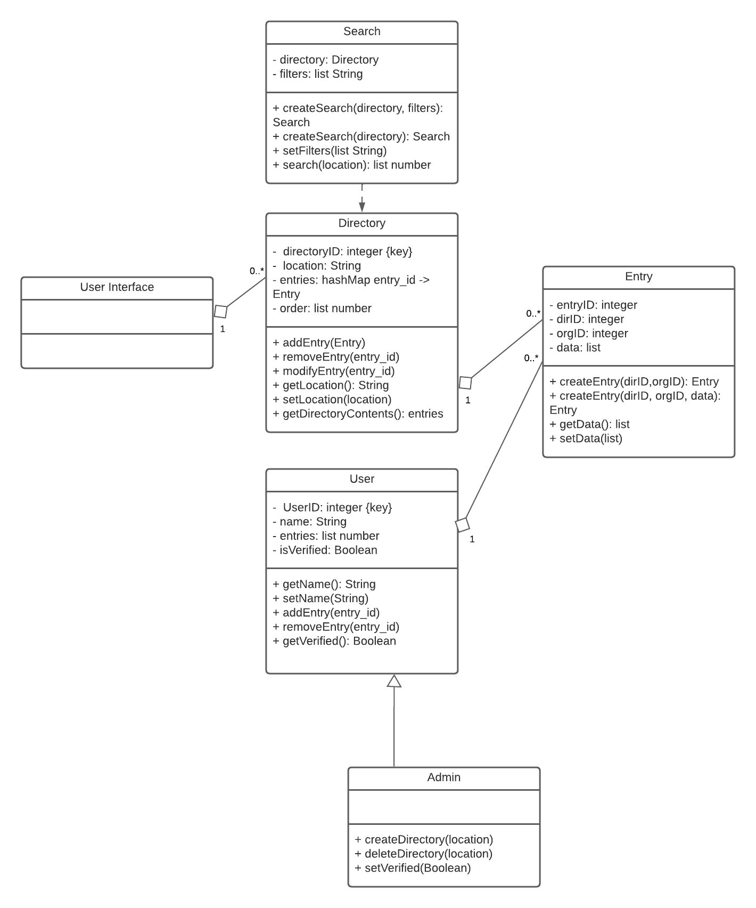

# **Assignment 2:** Individual Project
# Project Name: ./poverty/resources

## Description:
My project involves creating a directory of all non-profit organizations, projects, and/or food banks that offer menstrual products to those who require them as well as those that accept donations. Users will be able to enter the location and find places that are the closest to them.

## Welcome! To learn how to get started with contributing to this project, visit the resources below. These files can also be found in the docs/ directory:
* To install and use this project, follow this guide [here](./docs/Installation_Guide.md)
* Want to contribute to this project, click [here](./docs/Contributions.md)

## Diagrams

# Use Case Diagram

# Detailed Design Class Diagrams

# System Sequence Diagrams

# State charts

# Use Case Descriptions
Click [here](docs/Use_Case_Descriptions.pdf) to view the use case descriptions for this project

